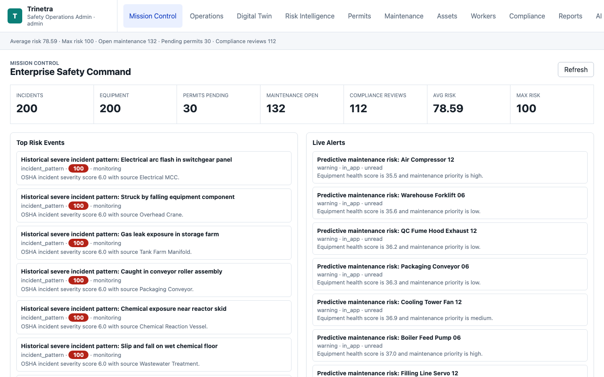
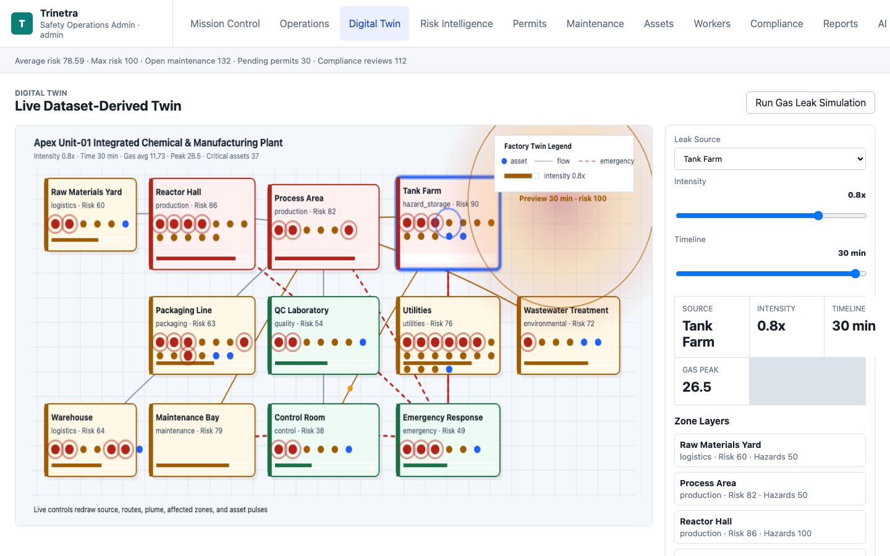
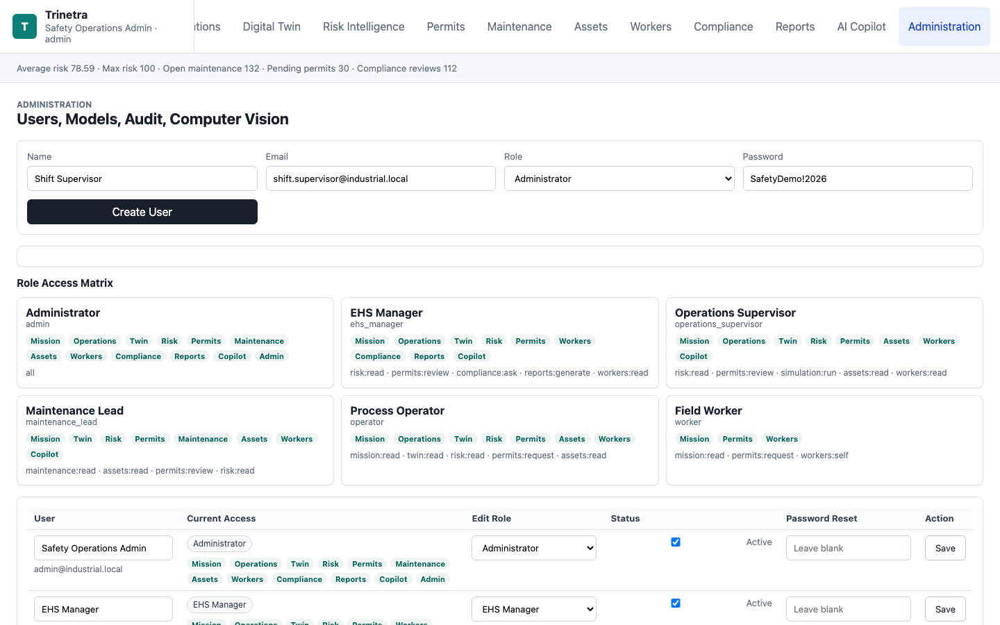
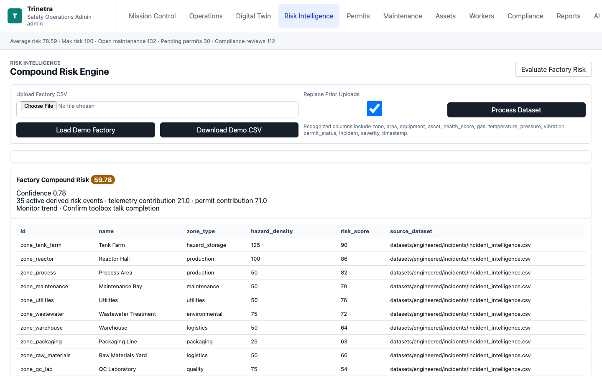

# Industrial Safety Intelligence Platform

An enterprise-grade, dataset-grounded **Industrial Safety Intelligence OS & AI Platform**. This platform integrates real-time CCTV computer vision incident detection, predictive maintenance, RAG-grounded regulatory intelligence, an equipment-hazard knowledge graph, a digital twin simulation engine, and an enterprise top-navigation web control interface.

> 🚀 **Live Deployment**: [https://trinetra-wsfr.onrender.com](https://trinetra-wsfr.onrender.com)

---

## 🖼️ Application Interface & Screenshots

📸 **Full UI Gallery**: Check out the complete UI screenshots and module previews in the [screenshots/](screenshots/) folder.

| Mission Control Dashboard | Digital Twin Simulation |
| :---: | :---: |
|  |  |

| CCTV Live Surveillance & Vision Studio | Risk Intelligence Engine |
| :---: | :---: |
|  |  |

---


## 🌟 Key Capabilities

1. **Continuous 4-Channel CCTV Live Surveillance Wall**
   - Autoplay, continuous-loop live camera feed wall monitoring plant zones.
   - Fixed-size 16:9 responsive frame layout with live status indicators (`● LIVE`).

2. **Pretrained YOLOv8 Computer Vision Engine (`computer_vision/cv_engine.py`)**
   - **PPE Compliance Inspection**: Detects workers missing hardhats or high-vis safety gear using color spectrum & spatial ratio analysis.
   - **Fallen Worker / Man-Down Detection**: Posture aspect-ratio analytics to detect fallen personnel.
   - **Vehicle-Pedestrian Proximity Hazard**: Distance metrics between forklifts/machinery and walking personnel.
   - **Restricted Area Intrusion**: Real-time perimeter intrusion alerts in hazardous zones.
   - **Fire & Smoke Optical Detection**: Identifies flame HSV color signatures and smoke density plumes.
   - **Incident Frame Studio**: Frame snapshot upload zone with instant bounding boxes, confidence badges, risk scores, and recommendations.

3. **Predictive Maintenance & Anomaly Detection (`ai/`)**
   - Remaining Useful Life (RUL) estimation trained on NASA C-MAPSS turbofan run-to-failure data and UCI AI4I 2020 predictive maintenance logs.
   - Process drift analytics on UCI SECOM semiconductor manufacturing signals.

4. **Grounded Regulatory RAG Engine (`rag/`)**
   - Context-grounded retrieval index covering OSHA 1910.147 (Lockout/Tagout), 1910.119 (Process Safety Management), 1904.39 (Incident Reporting), and NIST SP 800-82r3 (ICS Security).

5. **Equipment-Hazard Knowledge Graph (`knowledge_graph/`)**
   - Graph network mapping 1,000+ entity nodes and 1,400+ relationship edges across equipment, plant zones, incident severity, and required safety controls.

6. **Enterprise Security & Role-Based Access Control (RBAC)**
   - Granular permissions across 6 system roles: Administrator, EHS Manager, Operations Supervisor, Maintenance Lead, Process Operator, and Field Worker.

---

## 🛠️ Complete Technology Stack

### **Backend Core**
- **Language**: Python 3.13 / 3.9
- **API Framework**: [FastAPI](https://fastapi.tiangolo.com/) (Async ASGI REST API Engine)
- **Application Server**: [Uvicorn](https://www.uvicorn.org/) (High-performance ASGI server)
- **Database**: SQLite3 (WAL journal mode, foreign key enforcement, custom migrations)
- **Data Validation & Schemas**: Pydantic v2

### **Computer Vision & Machine Learning**
- **Object Detection**: [Ultralytics YOLOv8](https://docs.ultralytics.com/) (`yolov8n.pt`, `yolov8s.pt` pretrained models)
- **Deep Learning Framework**: [PyTorch](https://pytorch.org/) & torchvision
- **Image & Video Analytics**: OpenCV (`opencv-python-headless`), Pillow (`PIL`), NumPy
- **Feature Engineering**: Pandas, Scikit-Learn

### **Authentication & Cryptography**
- **Password Security**: PBKDF2-HMAC-SHA256 with 120,000 hashing iterations and random salts
- **Session Security**: Signed HMAC-SHA256 Bearer Access Tokens + rotated Refresh Tokens

### **Frontend Interface**
- **Structure**: Vanilla HTML5 with HTML5 Video (`autoplay loop muted playsinline`)
- **Styling**: Vanilla CSS3 (Custom Dark/Slate Theme, CSS Grid layout, Glassmorphism elements)
- **Interactivity**: ES6 JavaScript (Fetch API, FormData, FileReader, Canvas API)
- **Real-Time Feed**: WebSockets (`/ws/alerts`) for live notification pushes

---

## 📐 Architecture

📄 **PDF Architecture Document**: [architecture_diagram.pdf](architecture_diagram.pdf)

The following Mermaid diagram illustrates the end-to-end multi-layer architecture of the Industrial Safety Intelligence Platform:

```mermaid
flowchart TD
    subgraph ClientLayer ["1. Frontend Web OS (Client Layer)"]
        UI["Vanilla JS + HTML5 / CSS3 Interface"]
        SurveillanceWall["CCTV Live Surveillance Wall (4 Active Video Streams)"]
        Studio["CCTV Frame Incident Analysis Studio"]
        ControlMatrix["RBAC Administration & Audit Matrix"]
        AlertsWS["WebSocket Live Alert Stream Listener"]
    end

    subgraph APILayer ["2. FastAPI Core Backend Engine (API Layer)"]
        FastAPI["FastAPI Engine (Python 3.13)"]
        AuthModule["Auth & RBAC Module (PBKDF2 + Bearer Tokens)"]
        CVEndpoint["CCTV Vision Analysis Router (/api/computer-vision/*)"]
        RAGEndpoint["RAG Compliance Retrieval Router (/api/compliance)"]
        KGEndpoint["Knowledge Graph Query Router (/api/knowledge-graph)"]
        PredictiveEndpoint["Predictive Maintenance Router (/api/risk/*)"]
        AuditModule["Audit Logging & Security Module"]
    end

    subgraph AIEngineLayer ["3. AI & Analytics Core Engines"]
        CVEngine["CV Incident Detection Engine (cv_engine.py)"]
        YOLOModel["Pre-installed YOLOv8 Detectors (yolov8n.pt, yolov8s.pt)"]
        RAGEngine["RAG Citation Engine (TF-IDF Vector Index)"]
        KGEngine["Knowledge Graph Builder (1072 Nodes / 1492 Edges)"]
        MLModels["Predictive RUL & Anomaly Models (Scikit-Learn)"]
    end

    subgraph DataStorageLayer ["4. Data & Media Storage Layer"]
        DB[("SQLite3 Database (safety_platform.db)")]
        ModelStorage["Pretrained Model Registry (models/cv/)"]
        RAGIndex["RAG Index Storage (rag/index.json)"]
        KGGraph["Knowledge Graph Store (knowledge_graph/graph.json)"]
        MediaStorage["CCTV Streams & Snapshots (frontend/media/, cv_snapshots/)"]
        RawDatasets["Industrial Datasets (UCI, NASA C-MAPSS, OSHA)"]
    end

    %% Flow Connections
    UI -->|HTTP REST API| FastAPI
    SurveillanceWall -->|Continuous Loop Stream| MediaStorage
    Studio -->|Base64 Frame Upload| CVEndpoint
    AlertsWS <-->|Real-time WS Push| FastAPI

    FastAPI --> AuthModule
    FastAPI --> AuditModule
    CVEndpoint --> CVEngine
    RAGEndpoint --> RAGEngine
    KGEndpoint --> KGEngine
    PredictiveEndpoint --> MLModels

    CVEngine -->|Inference| YOLOModel
    CVEngine -->|Save Annotated Snapshot| MediaStorage
    RAGEngine -->|Read Citations| RAGIndex
    KGEngine -->|Query Relationships| KGGraph
    MLModels -->|Model Cards & Registry| ModelStorage

    AuthModule --> DB
    AuditModule --> DB
    RAGEngine --> RawDatasets
```




---

## 📁 Repository Architecture


```text
├── backend/
│   ├── app/
│   │   ├── main.py              # Main FastAPI application, APIs, auth, startup hooks
│   │   └── safety_platform.db   # SQLite application database
│   └── migrations/
│       └── 001_init.sql         # Core SQL database schema
├── computer_vision/
│   ├── cv_engine.py             # Pretrained YOLOv8 CCTV incident detection engine
│   ├── download_models.py       # Model pre-installation downloader
│   └── README.md                # Computer vision architecture specs
├── cctvs/                       # User live CCTV video feeds (.mp4)
├── models/
│   ├── cv/                      # Pre-installed YOLOv8 weights (yolov8n.pt, yolov8s.pt, model_manifest.json)
│   └── model_registry.json      # Model registry and performance metrics
├── frontend/
│   ├── index.html               # Main Enterprise UI & CCTV Live Wall
│   ├── styles.css               # Complete styling system
│   ├── app.js                   # Client logic and API integration
│   ├── cv_snapshots/            # Real-time annotated frame outputs
│   └── media/                   # Pre-installed CCTV stream files and posters
├── ai/                          # Training pipelines & AI agent definitions
├── rag/                         # Citation index & evidence search engine
├── knowledge_graph/             # Graph builder & graph.json network
├── datasets/                    # Public industrial datasets (UCI, NASA, OSHA)
├── scripts/                     # Data engineering & media generator scripts
└── tests/                       # Pytest test suite
```

---

## ⚡ Quick Start

### 1. Run Data Pipelines & Training (Optional background step)
```bash
python3 scripts/data_engineering/validate_datasets.py
python3 scripts/data_engineering/build_processed_datasets.py
python3 rag/build_rag_index.py
python3 knowledge_graph/build_graph.py
python3 ai/training/train_models.py
```

### 2. Launch Platform Server
```bash
python3 -m uvicorn backend.app.main:app --host 127.0.0.1 --port 8000
```

Open **[http://127.0.0.1:8000](http://127.0.0.1:8000)** in your browser.

### 🔑 Demo Credentials
- **Email**: `admin@industrial.local`
- **Password**: `SafetyDemo!2026`

---

## 🧪 Automated Testing

Run the unit test suite:
```bash
python3 -m pytest -q
```

---

## 📡 API Reference Endpoint Overview

| Method | Endpoint | Description |
| :--- | :--- | :--- |
| `GET` | `/api/health` | Health status and database check |
| `POST` | `/api/auth/login` | Authenticate user and issue JWT tokens |
| `GET` | `/api/computer-vision/status` | Active CCTV pipeline status & connected cameras |
| `POST` | `/api/computer-vision/analyze-file` | Analyze CCTV frame base64 / file for incidents |
| `POST` | `/api/computer-vision/run` | Execute plant-wide vision audit |
| `GET` | `/api/mission-control` | Real-time plant safety metrics & active alerts |
| `GET` | `/api/risk/compound` | Compound risk index & zone breakdown |
| `GET` | `/api/compliance` | RAG evidence query and citation search |
| `GET` | `/api/digital-twin` | Digital twin simulation state |
| `WS` | `/ws/alerts` | Live WebSocket alert push stream |
