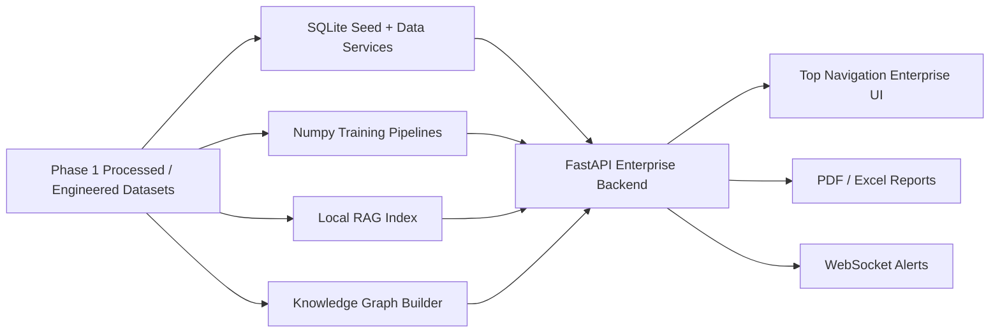

# Architecture

The system is intentionally dependency-light so it can run in a hackathon environment without external services. Production deployment can replace SQLite with Postgres/TimescaleDB, the JSON RAG index with a vector database, and local model artifacts with a model registry.

## Domains

- Authentication: JWT-like signed access tokens, refresh tokens, RBAC, session audit.
- Plant Management: organizations, plants, departments, zones.
- Asset Management: equipment, sensors, maintenance events.
- Worker Management: public OSHA ITA role-profile records.
- Telemetry: gas exposure and sensor readings derived from engineered datasets.
- Permits: permit review workflow with rule/RAG evidence.
- Incidents: OSHA severe injury intelligence.
- Risk Intelligence: compound risk scoring.
- Compliance: OSHA ITA DART/TCR and regulation documents.
- Knowledge: RAG and knowledge graph.
- Digital Twin: zone, asset, telemetry, heatmap, and route model.
- Reporting: PDF and XLSX generation.
- Administration: audit logs, model registry, CV status.

