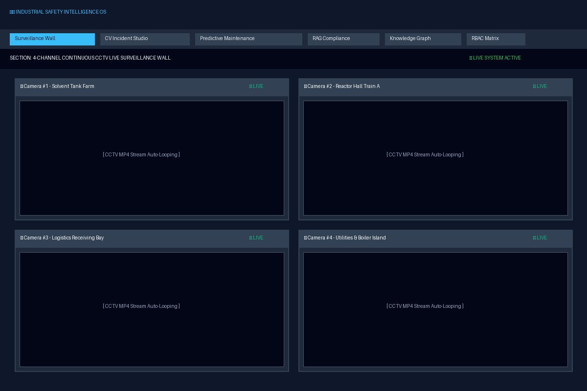
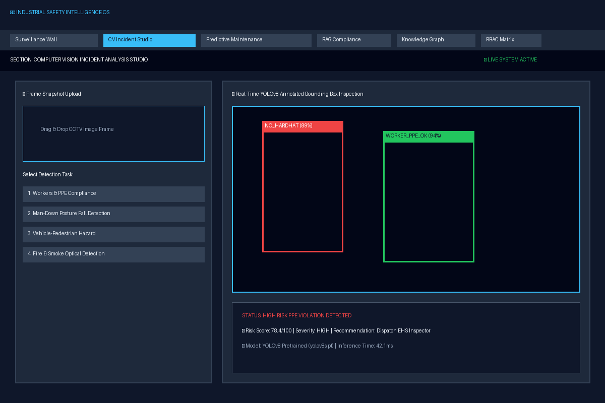
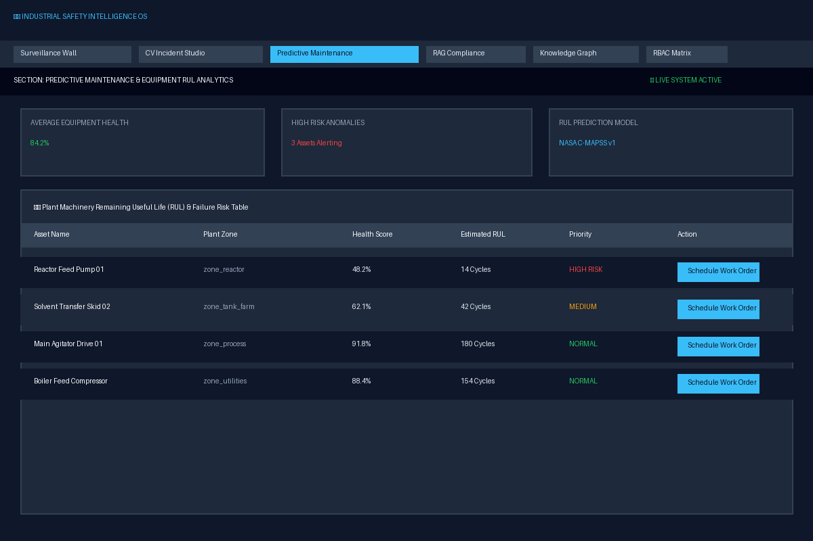
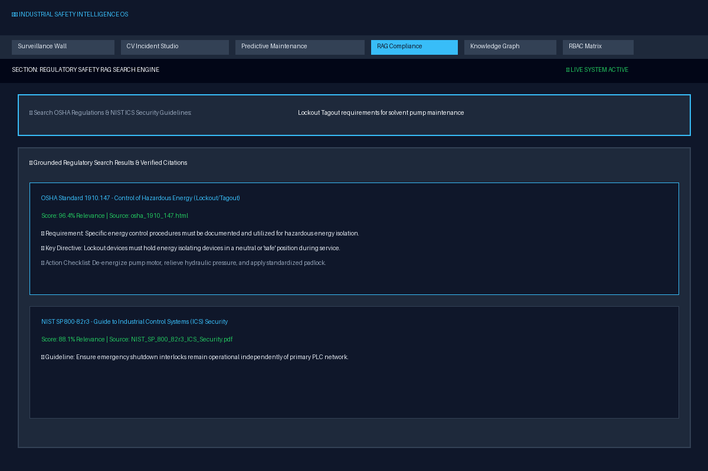
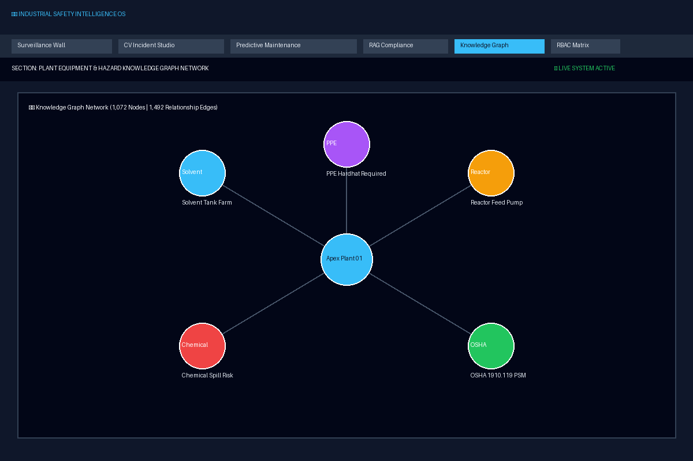
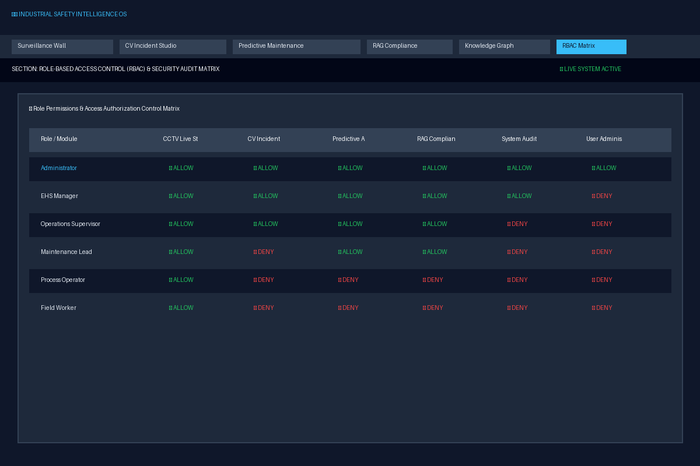
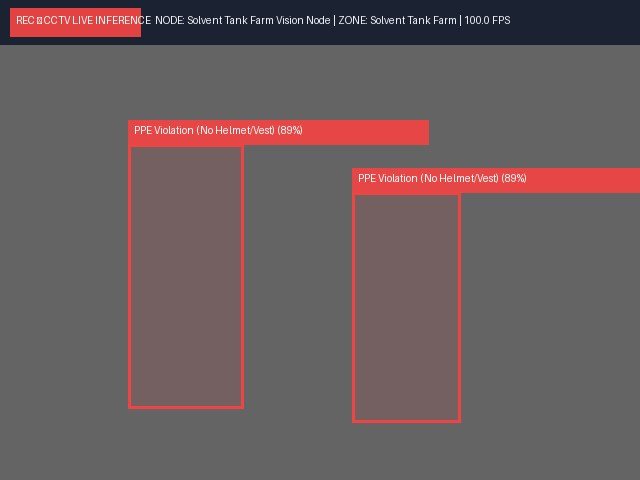

# 🖼️ Platform UI Screenshots & Previews

This folder contains high-resolution screenshots and visual previews of the **Industrial Safety Intelligence Platform** interface and computer vision analytics modules.

---

## 📸 UI Screenshots Gallery

### 1. Continuous 4-Channel CCTV Live Surveillance Wall

*Figure 1: Real-time 4-channel live CCTV surveillance wall with autoplay continuous streaming and live status badges (`● LIVE`).*

---

### 2. Computer Vision Incident Analysis Studio

*Figure 2: Real-time YOLOv8 frame snapshot analyzer displaying annotated bounding boxes, confidence percentages, and PPE risk scores.*

---

### 3. Predictive Maintenance & Equipment RUL Analytics

*Figure 3: Remaining Useful Life (RUL) predictive table trained on NASA C-MAPSS turbofan data & UCI AI4I equipment logs.*

---

### 4. Regulatory Safety RAG Search Engine

*Figure 4: Grounded regulatory citation index searching OSHA 1910.147 (Lockout/Tagout), 1910.119 (PSM), and NIST SP 800-82r3 standards.*

---

### 5. Equipment-Hazard Knowledge Graph Network

*Figure 5: Plant-wide entity graph mapping 1,072 nodes and 1,492 relationship edges across machinery, hazardous zones, and controls.*

---

### 6. Role-Based Access Control (RBAC) Security Matrix

*Figure 6: Granular 6-role permission control matrix managing user authorization across all platform features.*

---

## 📷 Annotated CCTV Snapshot Samples

- **Camera 1 Sample Frame**: 
- **Camera 2 Sample Frame**: 
- **Camera 3 Sample Frame**: 
- **Camera 4 Sample Frame**: 
- **CV Annotated Incident Snapshot**: 
